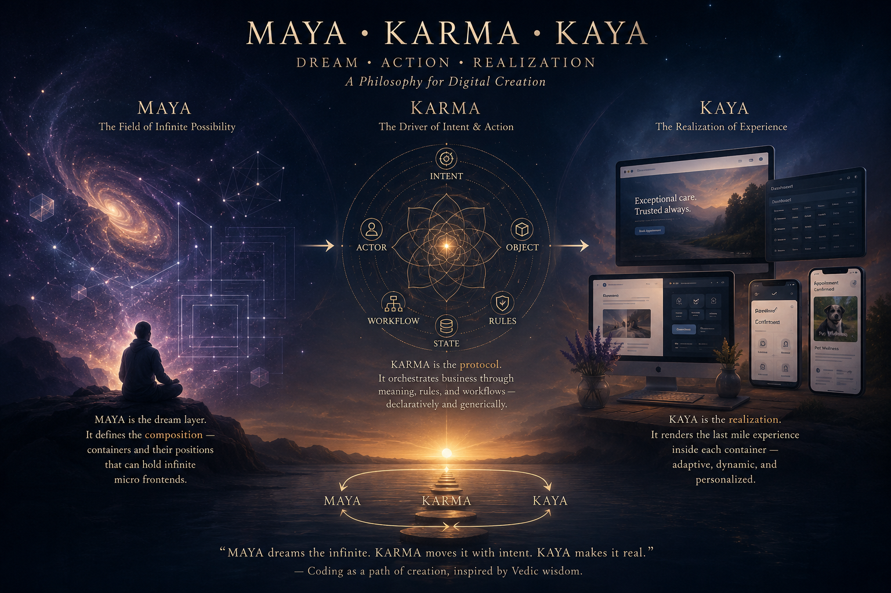

# Maya • Karma • Kaya

> *The Art of Building Living Software*



> “The future of software may not be bigger frameworks.
> It may be smaller reusable meaning.”

## Introduction

I started coding more than three decades ago.

I was never interested in building unnecessarily complex systems. In fact, I’ve always been obsessed with the opposite:
building extremely well-engineered systems that could scale from day one with minimal infrastructure, minimal operational cost, and very efficient engineering.

Back in the early 2000s, I was already building distributed systems designed to handle billions of requests. Even then, my philosophy stayed surprisingly simple.

Because fundamentally, most software systems are not that complicated.

Whenever a human interacts with a computer, they are usually doing some variation of:

* creating
* reading
* updating
* deleting
* viewing

In other words:

```text id="x0x8j0"
CRUD
```

That’s the foundation of almost every application ever built.

Then the next realization becomes simple:

If actions are synchronous:

* use protocols

If actions are asynchronous:

* use queues and orchestration

That’s it.

```text id="tgb7s4"
Human Interaction
        |
        v
      CRUD
        |
   ----------------
   |              |
Synchronous   Asynchronous
   |              |
Protocols      Queues
   |              |
 APIs        Orchestration
```

From there you can build almost anything:
enterprise systems,
consumer systems,
distributed systems,
workflows,
notifications,
APIs,
automation,
operational platforms.

The rest is mostly composition, semantics, orchestration, and discipline.

I’ve always believed systems should be:

* simple
* composable
* declarative
* idempotent where needed
* protocol driven
* operationally efficient

Not overengineered.

Over the years I built multiple frameworks, orchestration layers, reusable abstractions, deployment systems, semantic integrations, and micro-infrastructure architectures designed to make businesses operate efficiently without massive engineering overhead.

But something kept bothering me.

Most software development still revolves around rebuilding the same patterns repeatedly:
forms,
CRUD,
approvals,
workflows,
notifications,
dashboards,
websites,
APIs,
and operational systems.

Just wrapped in different frameworks and branding.

And frontend engineering became especially fragmented.

Designers focused on visuals.
Frontend engineers focused on frameworks.
Backend engineers focused on APIs.
Product teams focused on workflows.

Very few people could reason about the entire experience as one composable semantic system.

While building frontend systems over the years, I started realizing something important:

Much of the UI is actually declarative.

A page can often be rearranged through simple layout systems and CSS.
Themes can be separated from structure.
Personality can be separated from content.
The same workflow can render differently depending on context, user type, device, or business.

That realization slowly evolved into:

# Maya → Karma → Kaya

Inspired philosophically by years of reading Vedic philosophy and the Upanishads.

```text id="ahkz97"
Maya  = imagination / possibility / soul
Karma = action / intent / movement
Kaya  = realization / experience / body
```

Maya dreams.
Karma moves.
Kaya becomes visible.

---

# Maya — Infinite Possibilities

> “Maya is not the application.
> Maya is the infinite container of what could exist.”

Maya became the possibility layer.

The dream layer.

The infinite container of what could exist.

Not pages.
Not applications.
Not components.

Possibilities.

Maya became a frontend composition architecture capable of placing reusable containers and micro frontends anywhere on the screen.

```text id="zw2qai"
                 Maya
      Infinite Possibilities

      ┌───────────────────┐
      │   Container Grid  │
      └───────────────────┘
             / | \
            /  |  \
           /   |   \
       Website App Workflow
            \   |   /
             \  |  /
              \ | /
         Infinite MFEs
```

Originally, Maya was not about UI components themselves.

Maya became the container architecture.

A lightweight frontend composition system that defines:

* layouts
* rendering regions
* composition boundaries
* positioning
* application shells

Those containers can host an infinite number of micro frontends.

```text id="dfh7i4"
        Maya Container Layer

   ---------------------------------
   | Header                        |
   ---------------------------------
   | Hero          | CTA           |
   ---------------------------------
   | Feed          | Services      |
   ---------------------------------
   | Reviews       | Hiring        |
   ---------------------------------
   | Footer                        |
   ---------------------------------
```

Maya itself does not care what is inside the containers.

That realization became important because frontend engineering became fragmented over time:

* designers focused on visuals
* frontend engineers focused on frameworks
* backend engineers focused on APIs
* product teams focused on workflows

Very few people could reason about the experience as one composable semantic system.

---

# Karma — Action and Intent

> “Karma transforms imagination into operational reality.”

Karma became the semantic action layer.

Every business interaction could be reduced into:

```text id="ecaghy"
actor + intent + noun
```

Like:

* client requests appointment
* customer shares review
* doctor approves refill
* manager publishes feed

```text id="1rf2yx"
             Karma Protocol

        Semantic Backend Engine

      ┌─────────────────────┐
      │ actor+intent+noun   │
      └─────────────────────┘
                 |
        -------------------
        |        |        |
      ACL    Workflow   Schema
        |        |        |
      Roles   States   Storage
                 |
              Effects
```

Karma became the declarative backend protocol that defines:

* schemas
* workflows
* ACLs
* state transitions
* ownership
* APIs
* storage
* effects
* semantic meaning

Instead of repeatedly coding workflows and business logic, the system defines reusable meaning once.

Everything else becomes projection.

---

# Kaya — Realization

> “Kaya is where imagination becomes experience.”

Kaya became realization:
the actual digital experience users interact with.

My original goal with Kaya was actually very simple.

Almost every web page ultimately contains some combination of:

* forms
* lists
* grids
* spreadsheets
* containers
* blocks
* text
* images
* workflows
* interactions

Users interact with those elements.
And the system reacts based on those interactions.

That’s fundamentally what most applications are.

```text id="w1r8ia"
 User Interaction
        |
        v
  -----------------
  | Forms         |
  | Lists         |
  | Grids         |
  | Spreadsheets  |
  | Blocks        |
  | Containers    |
  | Images/Text   |
  -----------------
        |
        v
 System Reaction
```

The realization was that these experiences should not need to be rebuilt repeatedly for every framework, screen, or business.

They should emerge dynamically from semantic meaning.

Kaya became the realization layer inside the Maya containers.

```text id="wdhfrn"
        Maya Container
              |
              v
         Kaya Blocks

      -------------------
      | CTA             |
      | CRUD            |
      | Workflow        |
      | List            |
      | Detail          |
      | Feed            |
      | Editorial       |
      -------------------
```

Kaya dynamically generates:

* forms
* CTAs
* CRUD systems
* dashboards
* SEO pages
* workflows
* editorial layouts
* interactions

through declarative JSON configuration.

At its core, Kaya is built from:

* Mustache templates (structural skeletons)
* CSS layouts and skins
* themes
* personalities
* semantic rendering rules

```text id="2n8blw"
Maya  = imagination / possibility / soul
Karma = action / intent / movement
Kaya  = body / realization / experience
```

Just like the human body, Kaya provides:

* structure
* appearance
* interaction
* expression
* realization

while Maya remains the infinite possibility behind it.

The same semantic system can render completely differently simply by changing:

* layout CSS
* themes
* personalities
* rendering configuration
* user context

Which means in the future, experiences themselves can become dynamically personalized for every individual interacting with the system.

One user may see:

* calm editorial layouts
* warm colors
* minimal interaction

Another may see:

* operational dashboards
* dense workflows
* compact interfaces

Same semantic system.
Different realization.

That became incredibly powerful while building the veterinary platform for [Camino Alto Veterinary Hospital](https://caminoaltovet.com?utm_source=chatgpt.com).

For example:

```text id="wn4p03"
request.appointment
```

can dynamically generate:

* customer appointment CTA
* staff scheduling workflow
* admin CRUD screen
* SEO pages
* notifications
* queue views
* state transitions

all from shared semantic building blocks.

The public website becomes the AI-readable and SEO-readable projection of the same operational system powering the clinic internally.

---

# The Recursive Nature of Software

> “Reality itself is recursive.
> Software should evolve the same way.”

```text id="r6jivk"
         Maya → Karma → Kaya

      Imagination → Action → Reality
             ^                  |
             |__________________|

          Continuous Evolution
```

Maya creates possibilities.
Karma transforms possibilities through action.
Kaya realizes those possibilities into experience.

Then those experiences create new possibilities again.

That cycle never ends.

---

# The AI Era Changes Everything

> “AI did not invent composability.
> It finally made semantic systems practical.”

AI changes the economics of software.

AI no longer simply consumes software.
It reads systems.
Reasons about systems.
Automates against systems.
Acts on behalf of users.

Future systems must become:

* semantic
* composable
* workflow-aware
* AI-readable
* continuously evolving

That’s why I believe the future of software is not bigger frameworks.

It is smaller reusable meaning.

Smaller semantic units.
Smaller composable building blocks.
Less repeated engineering.
More emergence.

Today I’m applying this philosophy while building dynamic AI-native platforms for real businesses like [Camino Alto Veterinary Hospital](https://caminoaltovet.com?utm_source=chatgpt.com), where:

* public SEO pages
* customer CTAs
* staff workflows
* reviews
* hiring
* feeds
* operational systems
* admin applications

all evolve continuously from shared semantic models instead of endless rewrites.

The public website becomes the AI-readable and SEO-readable projection of the same operational system powering the secured application underneath.

Maybe software was never supposed to be static.

Maybe it was supposed to evolve like life itself.
